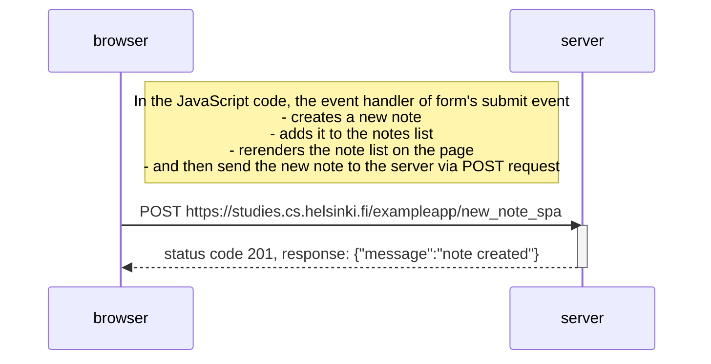

```mermaid
sequenceDiagram
participant browser
participant server

Note right of browser: In the JavaScript code, the event handler of form's submit event <br>- creates a new note<br>- adds  it to the notes list<br>- rerenders the note list on the page <br>- and then send the new note to the server via POST request

    browser->>server: POST https://studies.cs.helsinki.fi/exampleapp/new_note_spa
    activate server
    server-->>browser: status code 201, response: {"message":"note created"}
    deactivate server
```
